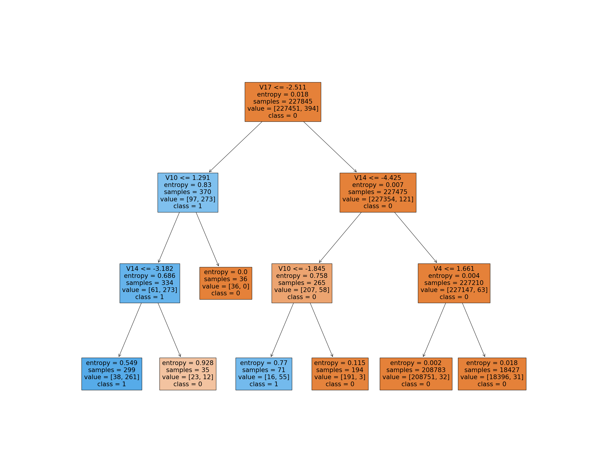
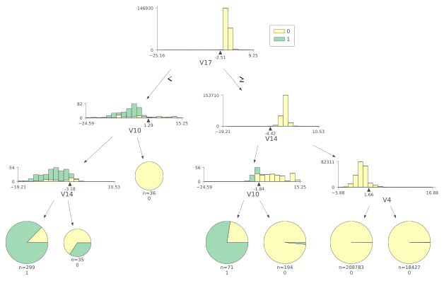

# Visualisation of elaborative decision trees with DTreeViz library as compared to SKLearn tree for credit card fraud detection dataset

A picture is worth more than thousand words! Hence we need better visualisations. One of the python libraries named dtreeviz is aimed at enhancing the decision trees that are produced by SKLearn library. 
Below is the difference in images of dtreeviz vs the SKLearn library

SKLearn | dtreeviz
 | 

